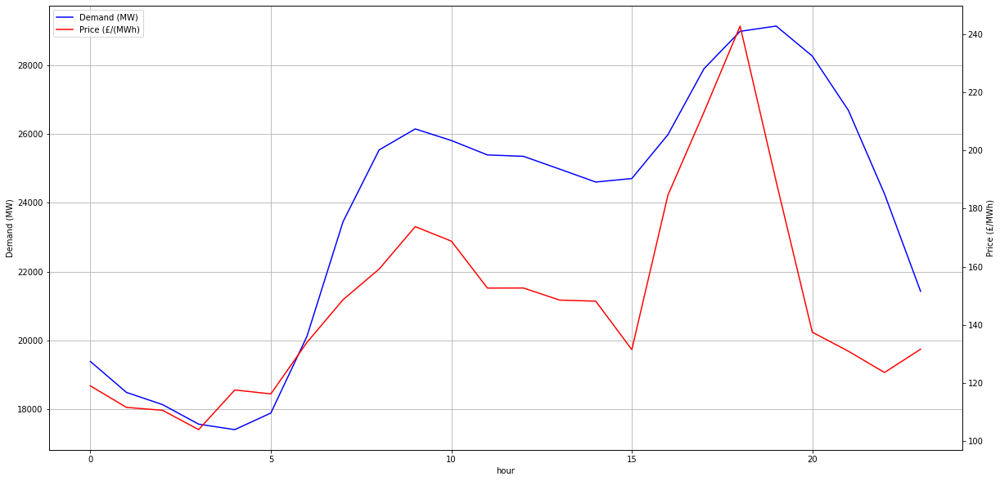
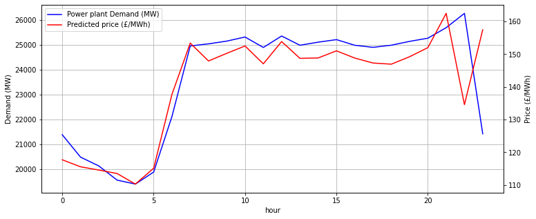
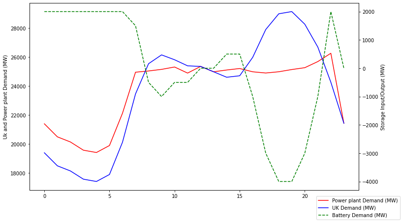

# UK grid analysis

Some exploratory work into how storage systems will affect the UK national energy demand and price for a University project. There are lots of caveats with the process / code here!

The study was performed on data from August 1st 2021 to October 25th 2021.

The energy price data was fetched from the Elexon BMRS, using this api https://github.com/OSUKED/ElexonDataPortal

## Plotting hourly averaged price and demand data

## Predicting price from demand and demand gradient (only using the averaged data)

## UK power station output after installing a grid level battery, using a simple model based on 2GW max charge rate and ~33GW of storage

